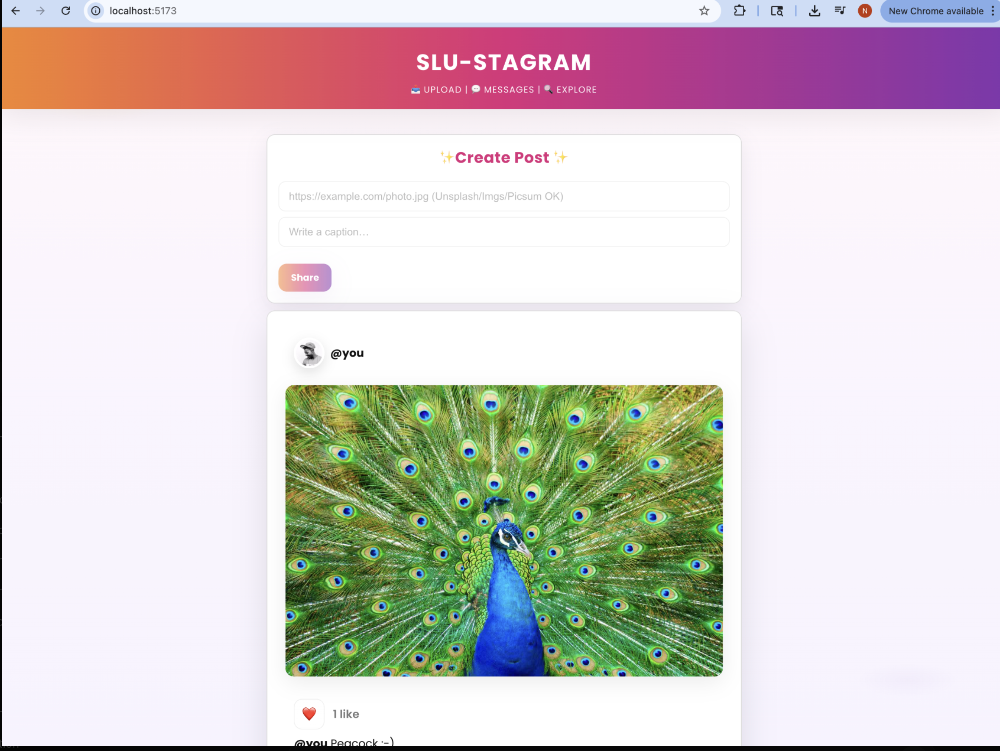
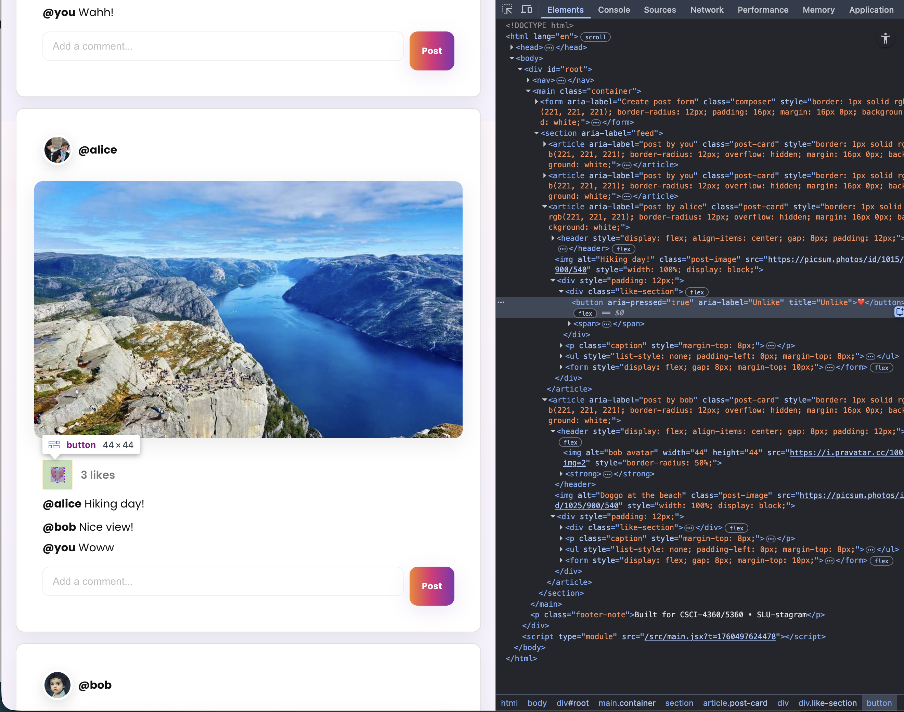

# LAB 2 – REACT TUTORIAL: BUILDING A MINI-INSTAGRAM

**NAME:** NANDITHA BHUSHANA NAGABHUSHANA
**BANNER ID:** 001388927
**COURSE:** CSCI-4360 / CSCI-5360 – WEB TECHNOLOGIES
**PROJECT:** MINI-SLUSTAGRAM

LIVE SERVER:- https://nandithabhushana26.github.io/mini-slustagram/
------------------------------------------------------------------

## PART 0 – SETUP (PROJECT INITIALIZATION)

### Overview

* Project initialized using **Vite** with React template.
* Dependencies installed via `npm i`.
* Development server started successfully with `npm run dev`.

### What is Vite?

* A modern frontend build tool that provides:

  * Lightning-fast HMR (Hot Module Replacement)
  * ES Module-based development
  * Minimal configuration

### Commands Executed

```bash
npm create vite@latest mini-slustagram -- --template react
cd mini-slustagram
npm i
npm run dev
```

### Verification

* Confirmed successful build and live app view on `http://localhost:5173/`
* Verified `src/main.jsx` includes `createRoot()` call.

### Screenshots


 Screenshots/Part0_Confirming src:main.jsx uses createRoot.png


----------------------------
## PART 1 – DATA MODEL
-----------------------------
### Overview

* Core data model defined inside `src/data/posts.js` as `seedPosts`.
* Each post includes:

  * `id`
  * `author`
  * `avatar`
  * `imageUrl`
  * `caption`
  * `likedByMe`
  * `likeCount`
  * `comments`

### Verification

* Posts rendered dynamically in the feed using React state from `useState(seedPosts)`.

### Screenshot


--------------------------------
## PART 2 – APP STATE & FEED
--------------------------------
### Overview

* Implemented **Feed** and **PostCard** components for dynamic rendering.
* App state managed via `useState()` to hold and update all posts.

### Components

* `Feed.jsx` → Maps through posts and renders `PostCard`.
* `PostCard.jsx` → Displays image, caption, avatar, and like button.

### Verification

* All posts render properly.
* No console or React key warnings.

### Screenshot


---------------------------------------------------------
## PART 3 – NAVBAR & POSTCARD (LIKES, CAPTION, IMAGE)
---------------------------------------------------------
### Overview

* Added top navigation bar with gradient title: **SLU-STAGRAM**.
* Integrated interactivity to each post via like button and avatar display.

### Features

* `Navbar.jsx`: Simple responsive navigation.
* `PostCard.jsx`:

  * `useState` used to toggle likes.
  * `aria-pressed` and `aria-label` for accessibility.
  * Real-time like count updates.

### Verification

* Likes toggle individually.
* No console warnings.
* Accessibility standards met.

### Screenshots


------------------------------------------
## PART 4 – COMMENTS (CONTROLLED FORM)
------------------------------------------
### Overview

* Added **CommentForm** and **CommentList** components to manage comment submission.
* Controlled form ensures input tracking and clearing post-submission.

### Features

* `CommentForm.jsx`: Uses `useState` to manage input; updates comments immutably.
* `CommentList.jsx`: Displays comments per post dynamically.

### Verification

* Comments update for the correct post.
* Input clears on submit.
* No accessibility or key warnings.

### Screenshots


------------------------------------------
## PART 5 – COMPOSER (NEW POST CREATION)
-------------------------------------------
### Overview

* Implemented **Composer** to allow users to add new posts.

### Features

* Validation ensures Share button only active for valid image URLs.
* On submit:

  * New post object created.
  * Added to top of feed via `setPosts(prev => [post, ...prev])`.
  * Input fields clear automatically.

### Verification

* Share button disabled for invalid/empty URL.
* New post appears instantly at top.
* Form clears correctly.
* No console warnings.

### Screenshots


-------------------------------------
## PART 6 – ROUTING & PERSISTENCE
-------------------------------------
### Overview

* Added **client-side routing** and **local persistence** for state.

### Routing

* Configured routes using `react-router-dom`:

  * `/` → Home Feed
  * `/u/:handle` → Filtered Profile Feed
* `Profile.jsx` uses `useParams()` to display user-specific posts.

### Persistence

* Data stored and loaded via `localStorage`:

  * One hook to read data on app start.
  * Another to save posts whenever state changes.

### Verification

* `/u/alice` filters only Alice’s posts.
* Likes, comments, and posts persist after refresh.
* Navigation seamless and accessible.

### Screenshots




##  BUTTON HOVER & LIKE/UNLIKE CONFIRMATION

### Overview

* Added hover and transition effects to interactive buttons.
* Dynamic accessibility with clear like/unlike confirmation.

### Features

* Hover effects highlight active state.
* Like toggle updates `aria-pressed` and `aria-label` dynamically.
* Smooth transitions via CSS.

### Verification

* Hover animation visible.
* ARIA toggle functional.

### Screenshots




---
---------------------------
## PROJECT STRUCTURE
----------------------------
### Folder Organization

```
mini-slustagram/
 ├─ node_modules/
 ├─ public/
 ├─ Screenshots/
 ├─ src/
 │   ├─ assets/
 │   ├─ components/
 │   │   ├─ CommentForm.jsx
 │   │   ├─ CommentList.jsx
 │   │   ├─ Composer.jsx
 │   │   ├─ Feed.jsx
 │   │   ├─ Navbar.jsx
 │   │   ├─ PostCard.jsx
 │   │   └─ Profile.jsx
 │   ├─ data/
 │   │   └─ posts.js
 │   ├─ App.jsx
 │   ├─ main.jsx
 │   └─ index.css
 ├─ README.md
 ├─ index.html
 ├─ package.json
 └─ vite.config.js
```

### Screenshot


---

## DATA RESET COMMAND

To clear stored posts and reset the feed:

```js
localStorage.removeItem('mini-insta-posts');
```

---

## FINAL OUTCOME

### Mini-SLUstagram Features

* Dynamic feed rendering
* Real-time like and comment functionality
* New post creation via composer
* Routing with user-based feeds
* Persistent data storage using localStorage
* Responsive and accessible UI with gradient theme

---
